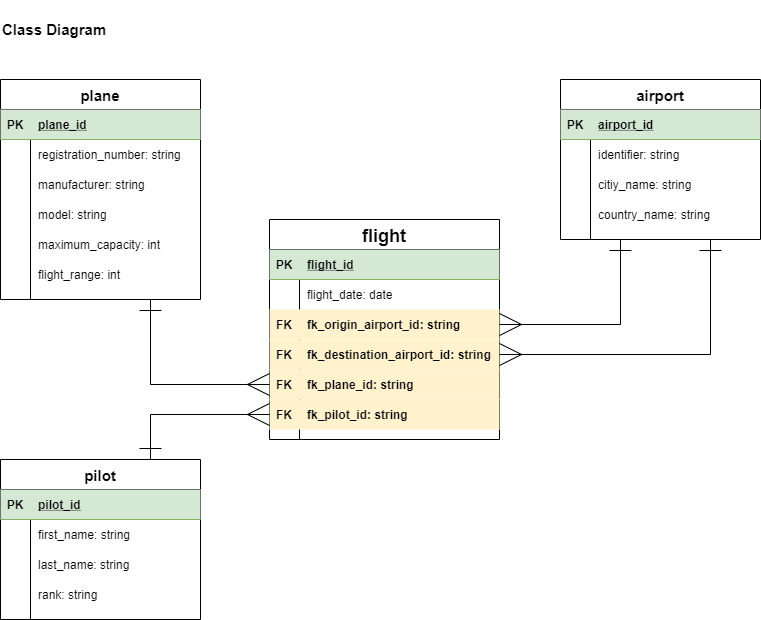

# CF-BE1-DB

## 1. Airline Concept



## 2 Airline Database

```
CREATE DATABASE airline DEFAULT CHARACTER SET utf8;
```

### 2.1 Plane Table

```
CREATE TABLE plane(
	plane_id int NOT NULL AUTO_INCREMENT,
	registration_number VARCHAR(55) NOT NULL,
	manufacturer VARCHAR(55),
	model VARCHAR(55),
	maximum_capacity int,
	flight_range int,
	PRIMARY KEY (plane_id)
);
```

#### 2.1.1 Plane Inserts
```
INSERT INTO plane VALUES (NULL, 'N1012', 'Airbus Corporate Jets', 'A330', 440, 11750);
INSERT INTO plane VALUES (NULL, 'N1007', 'Boeing Business Jets', '767', 375, 7130);
INSERT INTO plane VALUES (NULL, 'N1023', 'Embraer-Empresa Brasileira DR AeronÁutica', 'Lineage 1000', 19, 8519);
INSERT INTO plane VALUES (NULL, 'N1027', 'Bombardier Aerospace', 'CRJ1000', 104, 2830);
INSERT INTO plane VALUES (NULL, 'N1056', 'Airbus Corporate Jets', 'A340', 300,  13500);
INSERT INTO plane VALUES (NULL, 'N1086', 'Boeing Business Jets', '777', 550, 17395);
INSERT INTO plane VALUES (NULL, 'N1037', 'Embraer-Empresa Brasileira DR AeronÁutica', 'Lineage 1000', 19, 8519); 
INSERT INTO plane VALUES (NULL, 'N1098', 'Bombardier Aerospace', 'CRJ900', 104, 2830);
```

### 2.2 Airport Table

```
CREATE TABLE airport(
	airport_id int NOT NULL AUTO_INCREMENT,
	identifier VARCHAR(55) NOT NULL,
	airport_name VARCHAR(100),
	city_name VARCHAR(100),
	country_name VARCHAR(100),
	PRIMARY KEY (airport_id)
);
```

#### 2.2.1 Airport Inserts
```
INSERT INTO airport VALUES (NULL, 'ATL/KATL', 'Hartsfield–Jackson Atlanta International Airport', 'Atlanta, Georgia', 'United States');
INSERT INTO airport VALUES (NULL, 'PEK/ZBAA', 'Beijing Capital International Airport', 'Chaoyang-Shunyi, Beijing', 'China');
INSERT INTO airport VALUES (NULL, 'LAX/KLAX', 'Los Angeles International Airport', 'Los Angeles, California', 'United States');
INSERT INTO airport VALUES (NULL,'DXB/OMDB', 'Dubai International Airport', 'Garhoud, Dubai', 'United Arab Emirates');
INSERT INTO airport VALUES (NULL, 'HND/RJTT', 'Tokyo Haneda Airport', 'Ōta, Tokyo', 'Japan');
INSERT INTO airport VALUES (NULL, 'ORD/KORD', 'O-Hare International Airport', 'Chicago, Illinois', 'United States');
INSERT INTO airport VALUES (NULL, 'LHR/EGLL', 'London Heathrow Airport', 'Hillingdon, London', 'United Kingdom');
INSERT INTO airport VALUES (NULL, 'PVG/ZSPD', 'Shanghai Pudong International Airport', 'Pudong, Shanghai', 'China');
INSERT INTO airport VALUES (NULL, 'CDG/LFPG', 'Charles de Gaulle Airport', 'Roissy-en-France, Île-de-France (Paris)', 'France');
INSERT INTO airport VALUES (NULL, 'DFW/KDFW', 'Dallas/Fort Worth International Airport', 'Dallas-Fort Worth, Texas', 'United States');
INSERT INTO airport VALUES (NULL, 'CAN/ZGGG', 'Guangzhou Baiyun International Airport', 'Baiyun-Huadu, Guangzhou, Guangdong', 'China');
INSERT INTO airport VALUES (NULL, 'AMS/EHAM', 'Amsterdam Airport Schiphol', 'Haarlemmermeer, North Holland', 'Netherlands');
INSERT INTO airport VALUES (NULL, 'HKG/VHHH', 'Hong Kong International Airport', 'Chek Lap Kok, Islands, New Territories', 'Hong Kong SAR, China');
```

### 2.3 Pilot Table

```
CREATE TABLE pilot(
	pilot_id int NOT NULL AUTO_INCREMENT,
	first_name VARCHAR(100),
	middle_name VARCHAR(100),
	last_name VARCHAR(100) NOT NULL,
	rank VARCHAR(100),
	PRIMARY KEY (pilot_id)
);
```

#### 2.3.1 Pilot Inserts
```
INSERT INTO pilot VALUES (NULL, 'Danny', 'Detlef', 'Röhl', 'Captain');
INSERT INTO pilot VALUES (NULL, 'Toni', 'Detlef', 'Tapalović', 'First Officer');
INSERT INTO pilot VALUES (NULL, 'Hermann', 'Detlef', 'Gerland', 'Senior First Officer');
INSERT INTO pilot VALUES (NULL, 'Tanguy', 'Detlef', 'Nianzou', 'First Officer');
INSERT INTO pilot VALUES (NULL, 'Jérôme', 'Detlef', 'Boateng', 'Captain');
INSERT INTO pilot VALUES (NULL, 'Kingsley', 'Detlef', 'Coman', 'Captain');
INSERT INTO pilot VALUES (NULL, 'Leroy', 'Detlef', 'Sané', 'First Officer');
INSERT INTO pilot VALUES (NULL, 'Alphonso', 'Detlef', 'Davies', 'Training Captain');
INSERT INTO pilot VALUES (NULL, 'Leon', 'Detlef', 'Goretzka', 'Captain');
INSERT INTO pilot VALUES (NULL, 'Benjamin', 'Detlef', 'Pavard', 'First Officer');
INSERT INTO pilot VALUES (NULL, 'Niklas', 'Detlef', 'Süle', 'Captain');
INSERT INTO pilot VALUES (NULL, 'Hansi', 'Detlef', 'Flick', 'Captain');
INSERT INTO pilot VALUES (NULL, 'Miroslav', 'Detlef', 'Klose', 'First Officer');
```

### 2.4 Flight Table

```
CREATE TABLE flight(
	flight_id int NOT NULL AUTO_INCREMENT,
	flight_date DATE NOT NULL,
	fk_origin_airport_id INT NOT NULL,
	fk_destination_airport_id INT NOT NULL,
	fk_plane_id INT NOT NULL,
	fk_pilot_id INT,
	PRIMARY KEY (flight_id),
	FOREIGN KEY (fk_origin_airport_id) REFERENCES airport(airport_id),
	FOREIGN KEY (fk_destination_airport_id) REFERENCES airport(airport_id),
	FOREIGN KEY (fk_plane_id) REFERENCES plane(plane_id),
	FOREIGN KEY (fk_pilot_id) REFERENCES pilot(pilot_id)
);
```

#### 2.4.1 Flight Inserts
```
INSERT INTO flight VALUES (NULL, '2020-11-24', 1, 2, 3, 4);
INSERT INTO flight VALUES (NULL, '2020-11-25', 2, 1, 1, 2);
INSERT INTO flight VALUES (NULL, '2020-11-26', 3, 2, 2, 3);
INSERT INTO flight VALUES (NULL, '2020-11-27', 4, 3, 3, 5);
INSERT INTO flight VALUES (NULL, '2020-11-28', 4, 3, 3, 5);
INSERT INTO flight VALUES (NULL, '2020-11-29', 10, 9, 4, 7);
INSERT INTO flight VALUES (NULL, '2020-11-30', 12, 5, 5, 5);
INSERT INTO flight VALUES (NULL, '2020-12-01', 7, 10, 6, 6);
INSERT INTO flight VALUES (NULL, '2020-12-02', 8, 3, 3, 5);
INSERT INTO flight VALUES (NULL, '2020-12-03', 9, 5, 4, 1);
INSERT INTO flight VALUES (NULL, '2020-12-04', 6, 11, 5, 2);
INSERT INTO flight VALUES (NULL, '2020-12-05', 12, 12, 6, 3);
INSERT INTO flight VALUES (NULL, '2020-12-06', 11, 11, 2, 4);
INSERT INTO flight VALUES (NULL, '2020-12-07', 5, 10, 3, 5);
INSERT INTO flight VALUES (NULL, '2020-12-08', 12, 9, 4, 6);
INSERT INTO flight VALUES (NULL, '2020-12-09', 11, 8, 5, 7);
INSERT INTO flight VALUES (NULL, '2020-12-10', 9, 7, 6, 8);
INSERT INTO flight VALUES (NULL, '2020-12-11', 8, 6, 1, 9);
INSERT INTO flight VALUES (NULL, '2020-12-12', 7, 5, 2, 10);
INSERT INTO flight VALUES (NULL, '2020-12-13', 6, 4, 3, 11);
```

## 3. Example Queries

```
SELECT * FROM `flight` WHERE flight_date = '2020-12-05';
SELECT * FROM `flight` WHERE fk_plane_id = 2 ORDER BY flight_date ASC;
```
